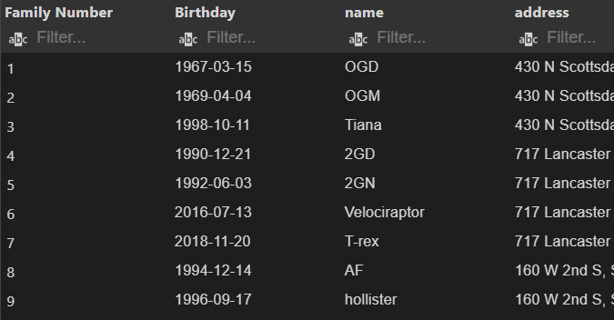
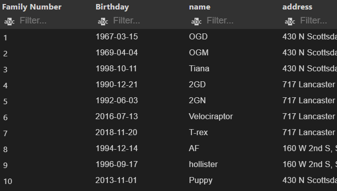
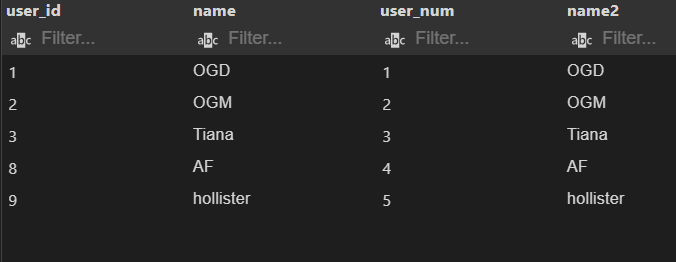
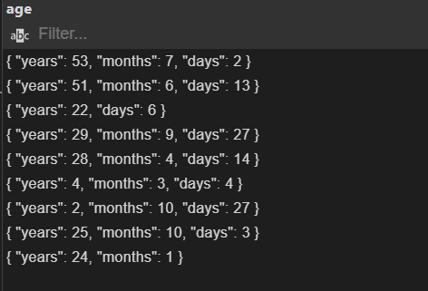
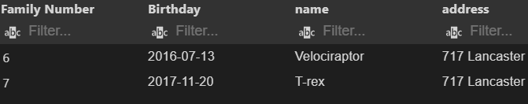

# Overview
This database was originally intended to make note of family members' birthdays and addresses. To keep their identity and personal information private, I have made fake information for the sake of practicing my new skills in PostgreSQL. 

I have also added some stretch goals with joining two tables together, adding an aggregate function and adding dates and filtering by those dates. I have inlcuded pictures of the results of each new technique. 

# Development Environent
* visual Studio Code 
* PostgreSQL 13.0

# Execution
To execute the program: 
* Download SQL tools onto VS code
* Create a new database connection
* Download database file
* Click the run database button at the top part of the screen. 

the following two pictures display the outcomes of creating the table, and adding new information to the table. I have left out deleting a part of the table for redundancy. 

Adding puppy birthday and address

Below are some stretch challenges. the first one adds a second table to the database and joins those two tables together

the second picture uses one aggregate function, age(). I felt that this one was best fitting to the tables that I created. I was very pleased with this filter result. 

this final stretch challenge filters the birthdates from 1998 and on. I purposefully intended for 2 birthdates to display.

# Useful Websites
* [Downloaded PostgreSQL language](https://www.postgresql.org/)
* [where most of my readings came from](https://www.postgresqltutorial.com/)