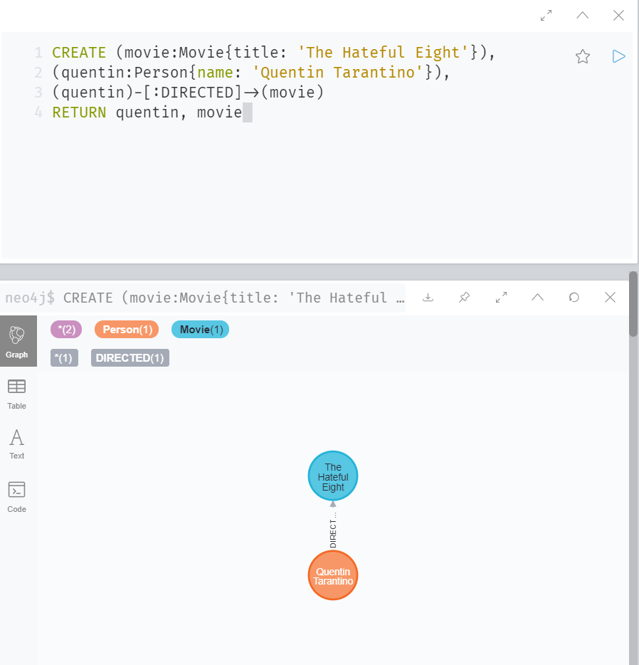

# Overview
I was working in a new environment. It is called Neo4j. it is a graphing style of SQL. However, as I was working on this small project, I realized that I have not found the ability to transfer the database to VS code. I have attached picture examples of my work and hope that it portrays my work created. 

# Development Environment
* Neo4j Desktop 4.1.0
# Execution 
I have the Neo4j program downloaded to my desktop. All work is usually done within the software. 

# Useful Websites
* Over the summer of 2020, I decided to take a Udemy course online. Throughout this course, I learned basic principles that apply not only to SQL but to the SQL graphing style that I took.  