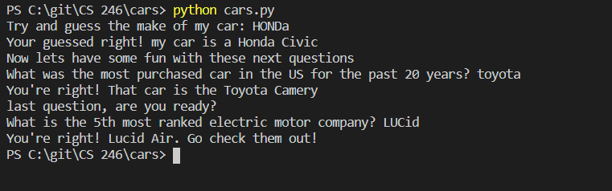

# Overview
Cars is a guessing game with a little bit of personal trivia. it is meant to use the cars class to answer all the questions included. 

# Development Environent
* visual Studio Code 
* Python 3.8.5

# Execution
to execute the program: `python cars.py`

# Useful Websites
* [To Upper and To Lower cases](https://www.jquery-az.com/learn-using-python-lowercase-uppercase-string-functions/)