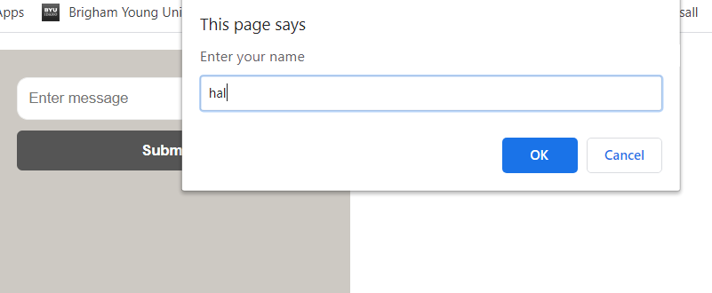
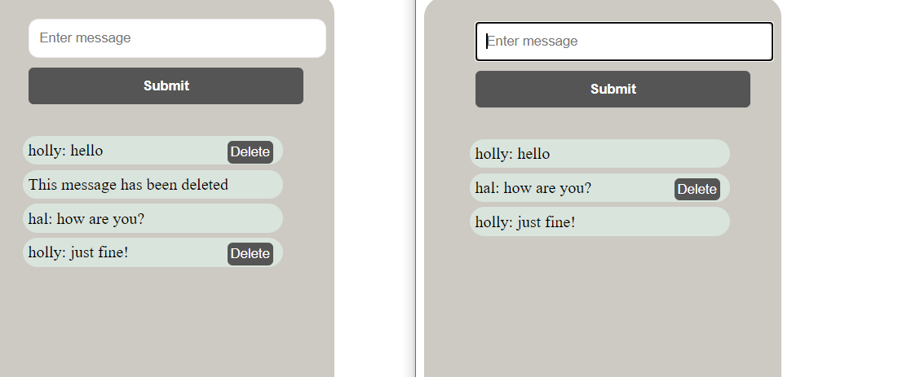
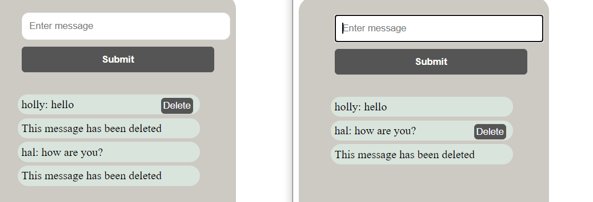

# Overview
this is a simple chat using firebase real-time database in order to communicate. I have made a really simple looking UI that is to help the user to understand who said what message.

# Development Environment
* visual Studio Code
* HTML
* CSS
* JavaScript coding

# Execution
* To execute the program: ctrl + b once the program is downloaded into VS Code

this first picture shows a very basic form of authentication being taken place. We see that the user only need to put in their name. and their messages will be saved and opened up when submitting. 

We see that messaging is being taken place and both users are able to message back and forth. 

I have also given the user the opportunity to delete a message if they want to as well. 

# Useful Websites
* watching youtube really helped me pull together a program that would work. provided:
* [youtube video](https://www.youtube.com/watch?v=aN1LnNq4z54&list=PL4cUxeGkcC9jUPIes_B8vRjn1_GaplOPQ)