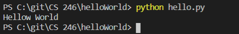

# Overview
simple code to say hello to the world. It uses python with visual studio code and github.

# Development Environent
* visual Studio Code 
* Python 3.8.5

# Execution
to execute the program: `python hello.py`


example code for my learning
```
x = 5
y = x + 1
print (y)
```

# Useful Websites
* [Python Reference](https://docs.python.org/3.8/library/index.html)