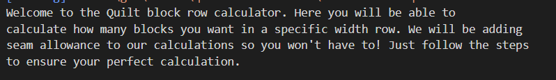
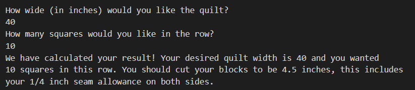
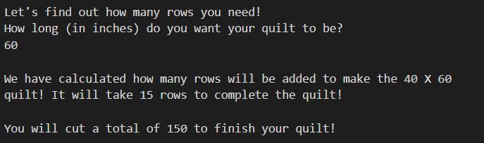

# Overview
progam that simulates user input for calculating seam allowance to a desired quilt length. I made the input instead of asking the user, since i did not know how to run Kotlin on the terminal. I still have a lot to learn. 

# Development Environment
* Visual Studio Code
* Kotlin (downloaded to VS code)
* assisted JDK (Java)

# Execution

# Useful Websites
I used a variety of websites to help me download the needed tools in order to make the program work. 