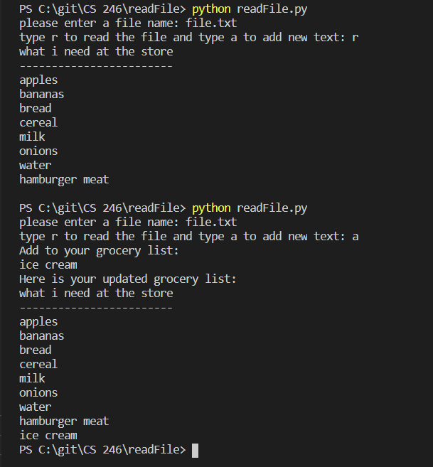

# Development Environment
* visual Studio Code
* Python 3.8.5

# Execution
To execute the program `python hello.py`

# Useful Websites
* W3Schools was a useful tool for me for this program
* [W3Schools](https://www.w3schools.com/python/python_file_write.asp)