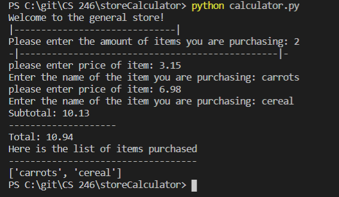

# Overview
Basic Calculator that will calculate the total cost of each item that was inputed into the screen. Once that total number has been put in, it will calculate tax and print the final total cost of all items. It will also print the items listed in the grocery list. 

# Development Environment
* Visual Studio Code
* Python 3.8.5

# Execution
To execute program: python calculator.py 

# Useful Websites
Websites that were extra help to me to get the program running
* [Reference to how to put a concantenated string through print](https://www.codespeedy.com/how-to-print-string-and-int-in-the-same-line-in-python/)
* [Reference on how to calculate tax in the final total](https://www.accountingcoach.com/blog/calculate-sales-tax#:~:text=Sales%20Tax%20Calculation,sales%20taxable%20receipts%20by%201.06.)