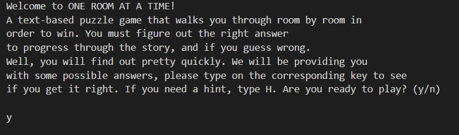
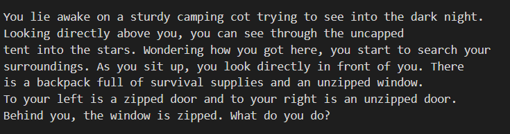
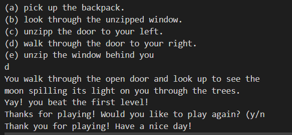

# Overview
This program simulates a text-based game. It is a prototype with one level within it. However, since I still do not know how to play as the user in VS code, I hard coded the player information. Look at the code to see the other possible responses. 

# Development Environment
* Visual Studio Code
* Kotlin (downloaded to VS code)
* assisted JDK (Java)

# Execution
this displays the welcome message that the user would see

this next photo will show the user the many options within the room that they are in. It specifically describes the key elements to the game so the user will know what to interact with. 

this shows the options to respond to for the game. The user will have many options to choose from. 

# Useful Websites
below is the website I have been using to help me write these programs.
* [Kotlin reference]([Python Reference](https://docs.python.org/3.8/library/index.html))